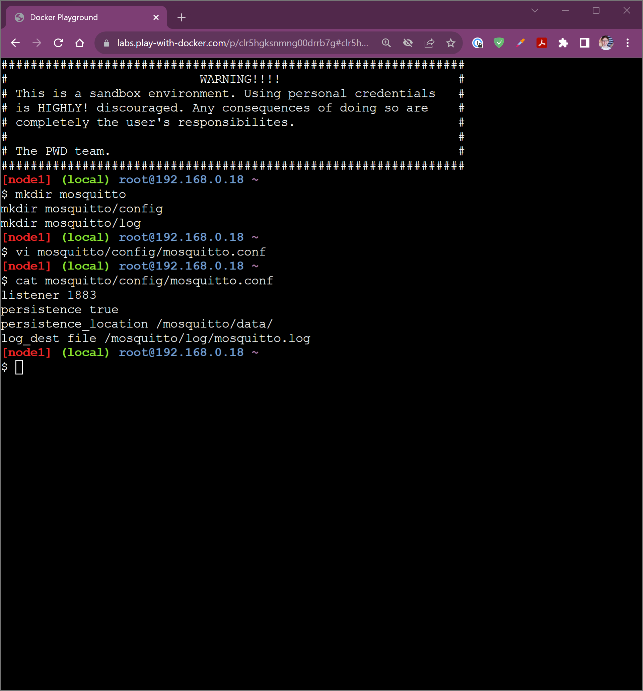

    <picture>
        <source media="(prefers-color-scheme: dark)" srcset="/img/ifce/logo-vertical-branca_media.png">
        <source media="(prefers-color-scheme: light)" srcset="/img/ifce/logo-vertical-colorida_media.png">
        
    </picture>

<b>INSTITUTO FEDERAL DE EDUCAÇÃO, CIÊNCIA E TECNOLOGIA DO CEARÁ</b> 
<b><i>CAMPUS</i> FORTALEZA</b> 
<b>TECNOLOGIA EM TELEMÁTICA</b>

CARLOS GABRIEL SACRAMENTO 
CÍCERA MÁRCIA DA FONSECA SILVA 
PABLO BUSATTO

2 de dezembro de 2023

# Avaliação 10 – MQTT

1. O MQTT (*Message Queuing Telemetry Trasport*) é um protocolo leve que implementa o modelo de transporte PUB/SUB (*publish*/*subscribe*). Esse modelo é usado em aplicações de mensageria. O MQTT é principalmente usando em aplicações IoT (internet das coisas). Essa atividade tem como objetivo implementar uma aplicação MQTT usando o `docker-compose`.
Evidenciar o funcionamento da aplicação usando *prints*. Sugerimos usar o [Play with Docker](https://labs.play-with-docker.com) com o `docker-compose`. Observar os *links* de artigos apresentando esse tema, anexos abaixo. Trabalho com equipes de no máximo três alunos.

   > 
     ***Figura 1**. Criação dos diretórios e do arquivo `mosquitto.conf`.*

   > ---

   > 
     ***Figura 2**. Conteúdo do `compose.yml`.*

   > ---

   > 
     ***Figura 3**. Conteúdo do `compose.yml` (continuação).*

   > ---

   > 
     ***Figura 4**. Execução do `docker compose up --detach`.*

   > ---

   > 
     ***Figura 5**. Execução do `docker compose up --detach` (continuação).*

   > ---

   > 
     ***Figura 6**. Inserção do caminho para o arquivo `passwd` contendo a senha.*

   > ---

   > 
     ***Figura 7**. Portas 1883, 8123 e 9001 abertas no Play with Docker.*

   > ---

   > 
     ***Figura 8**. Página de boas-vindas do Home Assistant.*

   > ---

   > 
     ***Figura 9**. Criação do usuário `gabriel-marcia-pablo`.*

   > ---

   > 
     ***Figura 10**. Inserção da localização no Home Assistant.*

   > ---

   > 
     ***Figura 11**. Pedido de permissões do Home Assistant.*

   > ---

   > 
     ***Figura 12**. Identificação de dispositivos no Home Assistant.*

   > ---

   > 
     ***Figura 13**. Página inicial do Home Assistant.*

   > ---

   > 
     ***Figura 14**. Lista de compras no Home Assistant, inicialmente vazia, que será usada para testar o envio de mensagens pelo MQTT.*

   > ---

   > 
     ***Figura 15**. Edição da lista de compras.*

   > ---

   > 
     ***Figura 16**. Edição da lista de compras (continuação).*

   > ---

   > 
     ***Figura 17**. Lista de compras renomeada para "A fazer".*

   > ---

   > 
     ***Figura 18**. Menu de configurações do Home Assistant. Neste menu, foi selecionado o item "Automações & Cenas".*

   > ---

   > 
     ***Figura 19**. Página de configuração de automações. Foi selecionado  "+ Criar automação" no canto inferior direito.*

   > ---

   > 
     ***Figura 20**. Opções para a criação de automação. Selecionada a primeira opção: "Criar nova automação".*

   > ---

   > 
     ***Figura 21**. Configuração de automação para acrescentar 3 itens à lista "A fazer" ao receber, por MQTT, a mensagem "atribuir" vinculada ao tópico "asr/nota".*

   > ---

   > 
     ***Figura 22**. Continuação da configuração de automação. Detalhes do primeiro item aa ser acrescentado à lista.*

   > ---

   > 
     ***Figura 23**. Continuação da configuração de automação. Detalhes do segundo item aa ser acrescentado à lista.*

   > ---

   > 
     ***Figura 24**. Continuação da configuração de automação. Detalhes do terceiro item aa ser acrescentado à lista.*

   > ---

   > 
     ***Figura 25**. Automação salva com o nome "atribuir-nota".*

   > ---

   > 
     ***Figura 26**. Resumo da automação "atribuir-nota".*

   > ---

   > 
     ***Figura 27**. Integração com MQTT.*

   > ---

   > 
     ***Figura 28**. Configuração do MQTT. O "Endereço do Broker" corresponde ao endereço IP disponibilizado pelo Play with Docker. Foi usada a porta 1883, porta padrão do MQTT, vide [Figura 7](#fig-07). Os campos usuário e senha foram preenchidos conforme a configuração feita no contêiner do eclipse-mosquitto (MQTT), vide [Figura 6](#fig-06).*

   > ---

   > 
     ***Figura 29**. Integração com MQTT configurada com sucesso.*

   > ---

   > 
     ***Figura 30**. Página de integração do Home Assistant com o MQTT. Selecionado o item "Configurar", à direita.*

   > ---

   > 
     ***Figura 31**. Publicação e escuta de um pacote para o tópico `asr/nota` com a mensagem `atribuir` (também chamada de valor ou payload, 'carga útil' em inglês). Evidencia-se o funcionamento do MQTT pelo processo de publicação e assinatura (publish/subscribe, PUB/SUB).*

   > ---

   > 
     ***Figura 32**. O envio do pacote por MQTT para o tópico `asr/nota` com a mensagem `atribuir` (vide [Figura 31](#fig-31)) ativou o gatilho da automação `atribuir-nota` anteriormente configurada (vide [Figuras 21](#fig-21), [22](#fig-22), [23](#fig-23), [24](#fig-24), [25](#fig-25) e [26](#fig-26)), acrescentando 3 itens à lista "A fazer".*

   > A execução desta atividade avaliativa pode ser assistida no vídeo "Automação com Docker Compose, MQTT e Home Assistant" elaborado pela equipe e disponível em: https://youtu.be/mGhKJEOL_Pg 
   > .
